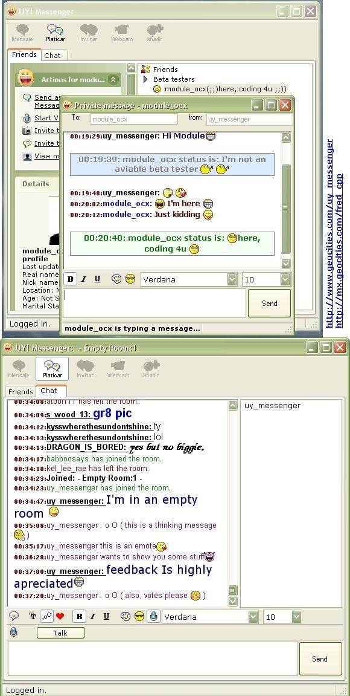



## uy\! messenger yahoo messenger and chat client; great GUI \!\!

### Description

This is a WORKING yahoo chat client with uniques features: You can run multiple instances (like multiyahoo) / log in various nicknames from the same account simultaneously / all smileys /font sizes, colors / privacy options /great GUI and months of work. I've added credits for lot of code, since I didn't code everything. (see about box) Maybe I need some help with this, comments, votes, help Is very apreciated.
 
### More Info
 

             |
---                |---
**Submitted On**   |2004-08-13 12:33:10
**By**             |[Fred\.cpp](https://github.com/Planet-Source-Code/PSCIndex/blob/master/ByAuthor/fred-cpp.md)
**Level**          |Advanced
**User Rating**    |5.0 (60 globes from 12 users)
**Compatibility**  |VB 6\.0
**Category**       |[Complete Applications](https://github.com/Planet-Source-Code/PSCIndex/blob/master/ByCategory/complete-applications__1-27.md)
**World**          |[Visual Basic](https://github.com/Planet-Source-Code/PSCIndex/blob/master/ByWorld/visual-basic.md)
**Archive File**   |[uy\!\_messen1781578132004\.zip](https://github.com/Planet-Source-Code/fred-cpp-uy-messenger-yahoo-messenger-and-chat-client-great-gui__1-55548/archive/master.zip)

